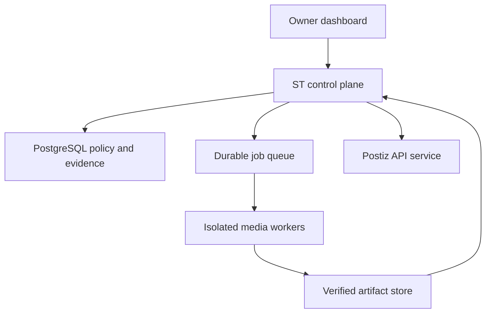

# ST Production House Architecture

## Boundary

ST owns the control plane, policies, identity, credentials, jobs, evidence, approvals, affiliate links, and publishing intent. Specialized media systems run behind versioned worker contracts and cannot write ST's database directly.

## Agent Digital Identity and Account Isolation

To protect client privacy and ensure enterprise-grade security, agent names are strictly internal identifiers. No internal agent name (e.g., JARVIS, SHERLOCK, PANCHI, VEDA) may ever automatically appear in public-facing channels, captions, metadata, or media watermarks.

### Isolated Agent Connections
Each agent manages its own completely isolated, unconfigured workspace connections in the database:
- **Operational Email Connections**: Seeding one unconfigured slot per agent to handle future correspondence. Once configured, email addresses must be unique in a case-insensitive manner across agents.
- **Social Media Connections**: Seeding unconfigured slots for YouTube, Instagram, Facebook, and Snapchat.
- **Important Notice**: Real email addresses, live OAuth connections, and social accounts are NOT connected or active yet in this foundation. Live OAuth and social publishing remain pending.
- **Primary-Account Constraints**: An agent can have multiple non-primary accounts per platform, but only one primary account per platform. This rule is database-enforced using a partial unique index.

### Access Restrictions
- No agent can access or borrow another agent's credentials, OAuth tokens, email connections, or social channels. This prevents horizontal privilege escalation.
- Dashboard views use an explicit safe-output DTO/allowlist to ensure secret keys, locators, and unallowlisted fields are never serialized.

## Agent Creative Charter and Channel Universe

Creative Charters define the long-term vision, concept, narrator parameters, and language defaults of an agent's assigned channel/show:
- **Separation of Names**: The internal agent name (like JARVIS or LAKME) remains separate from public brand, universe, niche, and attribution text.
- **Auditable & Immutable Versions**: Creative Charters are version-controlled and owner-approved. If a charter snapshot is edited, its previous approval becomes invalid for the new state. At most one active version can exist per charter, and at most one active charter assignment can exist per agent.
- **Lazy Hierarchy for Mythology (LAKME)**: Supports extremely scalable mythological universes by allowing episodes to be dynamically resolved on-demand using a hierarchy (Universe → Era or Yuga → Source Collection → Series → Season → Story Arc → Episode). This supports more than 8,000 episodes without generating millions of database rows.
- **Mitigation of Speculative Claims**: Mythology source-classification rules require distinguishing directly supported scriptures from region, narrative interpretation, or owner fictionalization. This represents a future safety standard rather than proof that content has been researched.

## Niche Reference and Visual Reference Library

A structured library separating visual and niche aspects ensures absolute control and prevents leakage across different subsystems:
- **Separate Niche & Visual Logic**: Niche references control audience, storytelling approach, pacing, structure, and tone. Visual references control art direction, color, shot composition, subtitles, and aspect ratio. Niche characteristics must not silently dictate visuals, and visual characteristics must not silently dictate story or narration.
- **Strict HTTPS and Host Allowlist**: Rejects non-standard ports, localhost, embedded credentials, and non-allowlisted domains. Only canonicalized YouTube URL formats are permitted inside the system, with duplicate detection blocking equivalent URL profiles.
- **Strict Classification**: Explicitly classifies references as: `youtube_channel`, `youtube_video`, `youtube_playlist`, `written_brief`, `authorized_image`, `uploaded_asset_metadata`.
- **Approved Status Lifecycle**: Exactly the 10 approved lifecycle statuses: `submitted`, `validation_failed`, `awaiting_analysis`, `analysis_in_progress`, `analysis_failed`, `draft_profile_ready`, `awaiting_owner_review`, `approved`, `rejected`, `inactive`.
- **Flexible Scope Assignments**: References can be assigned separately to Creative Universe, series, season, story arc, episode, standalone promotional Reel, or main-video promotion.

## Owner-Agent Communication Studio and Blueprinting

The Owner-Agent Communication Studio handles the onboarding phase, where the Owner and the chosen Agent collaboratively refine the Agent's blueprint across exactly 22 Interactive Interview Catalog sections:
- **Comprehensive 22 Sections**: Spans Brand Voice, Color Palettes, Aspect Ratios, Call to Actions, Soundscapes, and Parallel execution options.
- **Zero-Trust Message Engine**: Validates messaging matrix patterns, preventing unauthorized owners from accessing active session threads, and ensuring valid sender-to-message combinations.
- **Strict Version Control & Validation**: Validates all 22 sections, checks brand safety terms (blocks keywords like 'unsafe' and 'unfiltered'), scans snapshots recursively to remove credential leaks, and ensures any unresolved open-ended questions block version generation.
- **Immutable Approval Locking**: Once approved, the exact blueprint draft becomes inactive (cannot be edited), the approved version is marked approved, older versions are superseded, and the blueprint is permanently frozen.

## Runtime rules

- An authenticated owner creates a task or promotion campaign.
- ST resolves the selected agent and that agent's task-scoped provider policy.
- Independent jobs may run in parallel. One job tries providers sequentially: primary, secondary, tertiary, then a local open-source emergency provider.
- Workers receive an opaque job-scoped secret handle, not stored credentials.
- A worker success requires an artifact hash and provider/renderer evidence.
- Publishing is blocked until the owner approves the exact immutable snapshot, binding valid public attribution. If no valid public brand/channel attribution is configured, publishing is immediately blocked with `PUBLIC_PUBLISHING_IDENTITY_REQUIRED`.
- Postiz returns actual platform results; ST stores their response hash and IDs.

## Concurrency

Use PostgreSQL `FOR UPDATE SKIP LOCKED` or a transactional queue. Leases must be time-bounded and reclaimable. Apply:

- a global worker limit;
- a per-agent limit;
- a provider/account rate limit;
- GPU/CPU resource pools;
- idempotency keys and dead-letter queues.

Parallelism happens across agents and jobs. Provider fallback for a single task is sequential to avoid duplicate cost and conflicting outputs.

## Promotions

The database owns a unique `product_identities.identity_sha256`. One `promo_reels` row may reference that identity. Render failures add `promo_reel_versions`; they never create another logical Reel.

Duplicate campaigns are separate business records and require explicit owner authorization. They cannot bypass the unique Reel rule.

Main-video promotion is a separate placement record. Intake must always ask the owner whether to include it and, if yes, which episode.

Affiliate links are campaign/platform placements, not new videos. Every link requires an allowlisted HTTPS domain, disclosure, redirect/SSRF inspection, malware screening, expiration policy, and owner approval.
